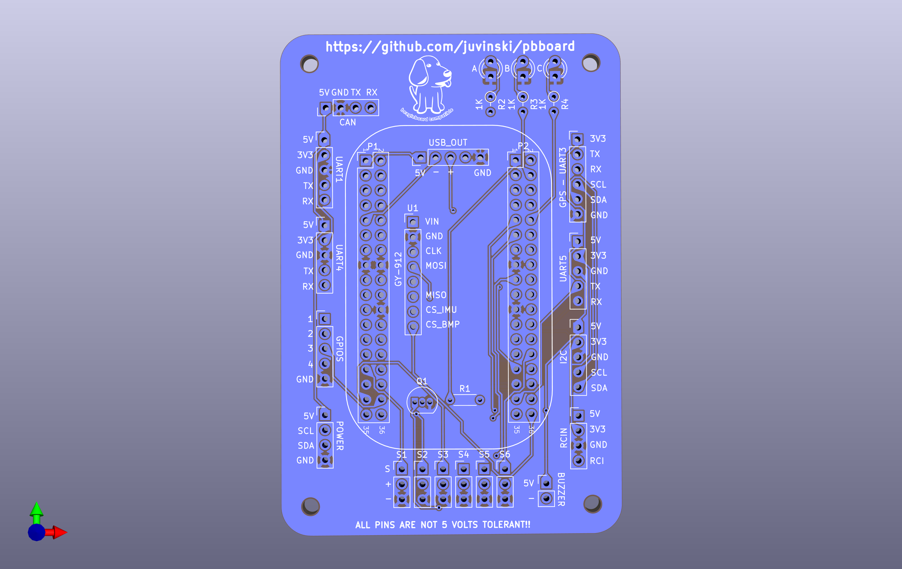
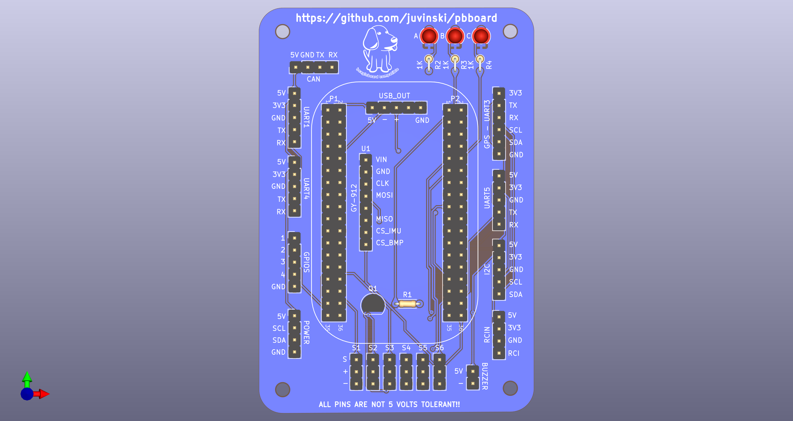
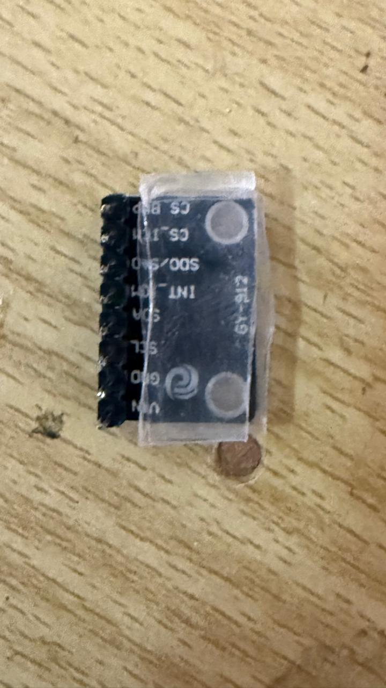

# PocketBeagle 2 DIY Cape for Ardupilot
This project aim enable to run [Ardupilot](https://ardupilot.org/) on the [PocketBeagle 2](https://www.beagleboard.org/boards/pocketbeagle-2) Board.

# Board manufacturing
## PCBWay
I'm using the PCBWay to produce the boards - 5 boards have a cost of USD 5.00
You can use [this file](Board_Archives_Manufacturing/PocketPilot2.kicad_pcb.zip).

## Other Services
I believe the same file can be used by other online PCB manufactures.

# Board Images
## Board Only

## Board Components - Preview

# Hardware instructions
## Board manufacturing
### Board version 1.1

### Soldering resistors, transistor and rc output headers 

### Soldering output headers 

### Soldering Pocketbeagle 2 headers

### Soldering Leds

### Preparing the IMU - using double sided tape

### Soldering the IMU

### Finished

## Schematic
The schematic can be found [here](Schematic/PocketPilot2.pdf).

## Parts
	- 1 IMU [GY-912](https://www.ebay.com/itm/166809278501)
	- 4 Resistors 1KΩ
	- 2 Resistors 10k 0.1%
	- 2 Resistors 20k 0.1%
	- 3 Led Red, Blue and Green color 
	- 1 BC548 NPN Transistor
	- 1 I2C Digital [Power Module/Monitor](https://ardupilot.org/copter/docs/common-powermodule-landingpage.html#i2c-power-monitor)
	- 6 Pin header 1 x 5 straight
	- 3 Pin header 1 x 4 straight
	- 1 Pin header 1 x 6 straight
	- 6 Pin header 1 x 3 straight or 90°
	- 1 Pin header 1 x 2 straight
	- 1 Pin header female 1 x 8 - optional

## Details
To use the I2C power sensing you can use the [Holybro PM2D](https://holybro.com/products/pm02d-power-module?srsltid=AfmBOoraJGVR_kFEiSwKRgzMLQZ1dEZXMhWgGvN6DEnkXQVvNgj2pTN2).
The analog power sensing is using 4 resistors.
The outputs of the sensor was changed by a female reader and both 5Volts output connectec together as the GND.
The GY-912 is soldered direct over the board once the PocketBeagle 2 is over it and the space between the PocketBeagle 2 board and the DIY board it's small.
Once the Kicad project is shared, you can modify freely according your needs.
The CAN interface need a CAN Transceiver breadboard like CJMCU-1051 (or any TJA1051) with 3.3Volts interface for TX and RX.
The buzzer circuit is simple but powerfull.
For the USB OTG you are free to use what kind of USB is more suitable for you. The board export 5 pins there the 4th is not connected.

## Board details
	- 4 UARTs - One have the I2C to be used with a GPS + Compass
 	- 3 I2Cs - One is under the Power header, Other in the GPS header and one for I2C
  	- 4 GPIO pins with GND
	- Support for I2C and/or Power Sensing
   	- 6 Outputs
   	- Buzzer output for an Active buzzer
*** All pins is just 3.3 Volts ***  
*** 5 Volts will brick your PocketBeagle 2 ***

# Software Instructions
The software instructions can be found at [Ardupilot Wiki] (https://github.com/juvinski/ardupilot_wiki/blob/pocket2/common/source/docs/common-pocketbeagle-2.rst).
This version will be present in Ardupilot official wiki when the version 4.7 release.